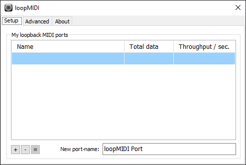
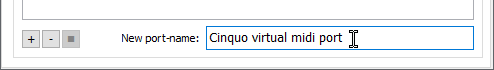
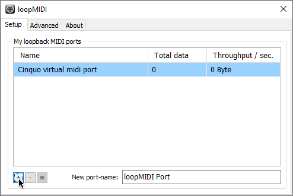

# How to set up a virtual MIDI device for Cinquo

1. Download Tobias Erichsen's [loopMIDI](https://www.tobias-erichsen.de/software/loopmidi.html)
2. Open loopMIDI, it should look something like this:  
   
3. Change the 'New port-name' field to anything you like, the only requirement is that it includes the word cinquo (not case sensitive).  
   
4. Click the + button. You should now see a new MIDI port  
   
5. You can now close loopMIDI and start using Cinquo's MIDI features!
